# 企业信息化战略与实施

---
1. 信息与信息化的概念
2. 信息系统战略规划
3. 信息系统生命周期
4. 政府信息化与电子政务
5. 企业信息化与电子商务
   - 5.1 企业资源计划
   - 5.2 客户关系管理
   - 5.3 供应链管理
   - 5.4 产品数据管理
   - 5.5 商业智能
   - 5.6 决策支持系统
   - 5.7 知识管理
   - 5.8 业务流程重组
6. 企业门户
7. 企业应用集成
8. 课后练习题

---

# 一、信息的概念及特点

## 信息的定义
* 香农∶信息就是不确定性的减少。
* 维纳:信息就是信息，既不是物质，也不是能量。

## 信息的特点
* 客观性（真伪性）∶也叫事实性，不符合事实的信息不仅没价值，还有副作用。
* 动态性:信息随着时间的变化而变化。
* 层次性:信息可分为战略级、管理级和操作级。
* 传递性:信息在**时间上的传递即是存储;在空间上的传递即是转移或扩散**。
* 滞后性:信息是数据加工后的产物，所以相对数据有滞后性。
* 扩压性:信息和实物不同，它可以扩散也可以压缩。
* 分享性:信息可以分享，这和物质不同，并且信息分享具有非零和性。

## 信息化的概念
* 信息化是从工业社会到信息社会的演进与变革。
* 信息化的主体是全体社会成员（政府、企业、团体和个人），时域是一个长期过程，空域是经济和社会的一切领域，手段是先进社会生产工具。

## 信息化对组织的意义
* 组织的结构创新︰如虚拟企业、虚拟社区。
* 组织的管理创新:实施电子政务、建立电子政府、建立电子社区以提升管理水平。
* 组织经营创新∶利用信息化将经营和管理融为一体。
* 造就信息化的人才队伍:三类人才(IT专业人才，业务人才，专家型人才)。

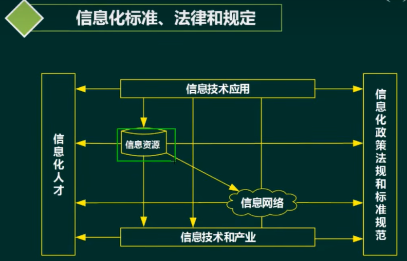

# 二、信息系统战略规划-方法

## 第一阶段：以数据处理为核心围绕职能部门需求
* 企业系统规划法(BSP): **自上而下识别系统目标，自下而上设计信息系统**，对组织机构的变动具有适应性。
* 关键成功因素法（CSF):找实现目标的关键信息集合，从而确定**开发优先次序**。
* 战略集合转化法(SST):把战略目标看成**信息集合，把战略目标转变成信息系统的战略目标**。

## 第二阶段：以企业内部MIS为核心围绕企业整体需求
* 战略数据规划法（SDP)
* 信息工程法(IE)
* 战略栅格法(SG)

## 第三阶段：综合考虑企业内外环境以集成为核心，围绕企业战略需求
* 价值链分析法(VCA)
* 战略一致性模型(SAM)

# 三、 信息系统的生命周期

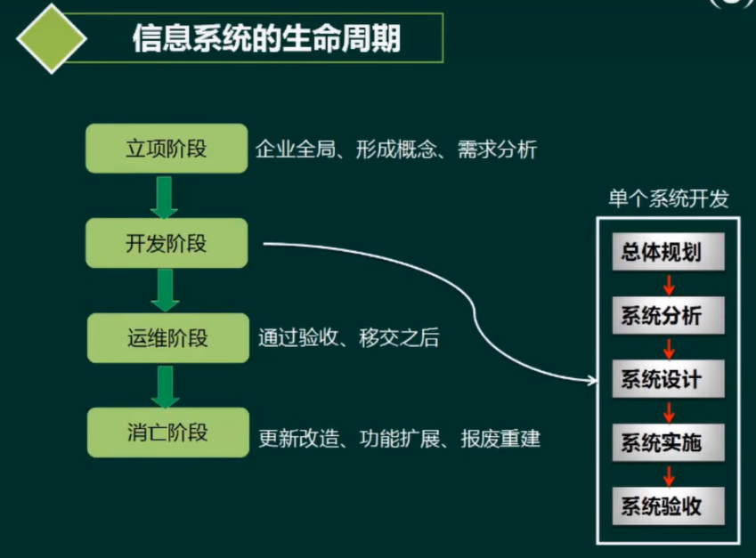

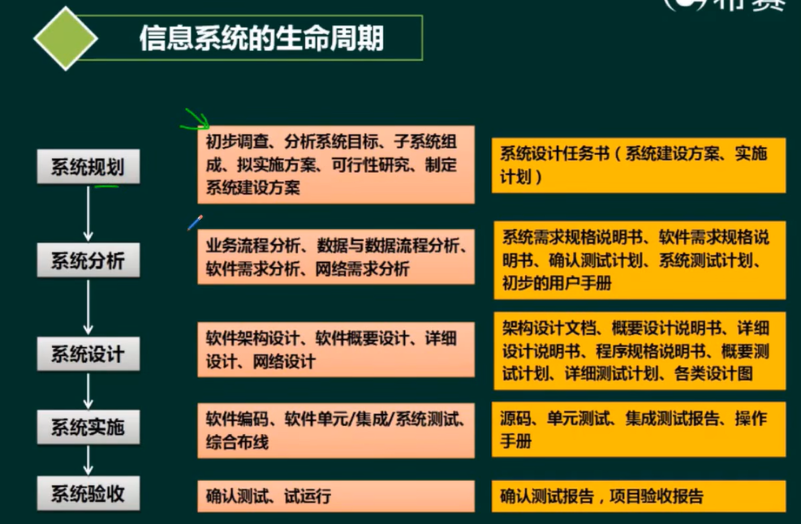

# 四、政府信息化与电子政务

* 政府对政府(G2G) (Government To Government)
* 政府对企业(G2B）或B2G(Government To Business）
* 政府对公民(G2c)或C2G( Government To Citizen)
* 政府对公务员(G2E)(Government To Employee）

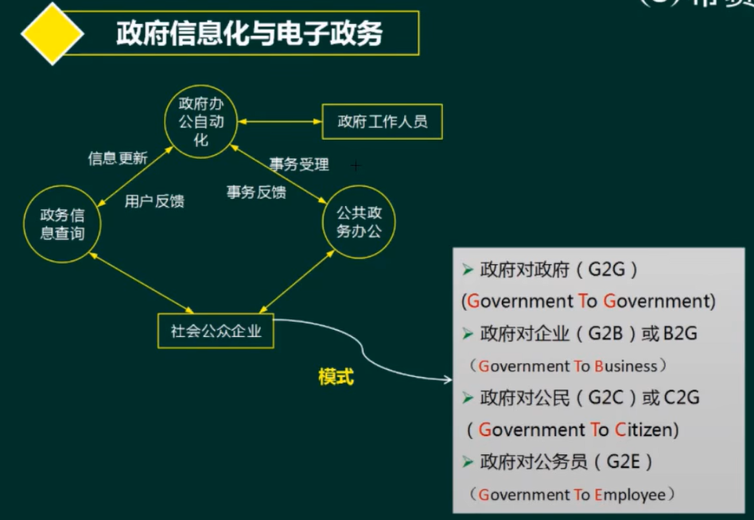

电子商务的形式
* 企业对消费者(B2C)
* 企业对企业（B2B )
* 消费者对消费者(C2C)
* **线上对线下(O2O)**

# 五、企业信息化与电子商务

## 企业信息化与电子商务-企业资源计划（ERP)

* 管理思想︰他是管理思想的变革。
* 软件产品︰但不是直接买来就用，需要个性化的开发与部署。
* 管理系统:存在众多的子系统，这些**子系统有统一的规划**，是互联互通的，便于事前事中监控。

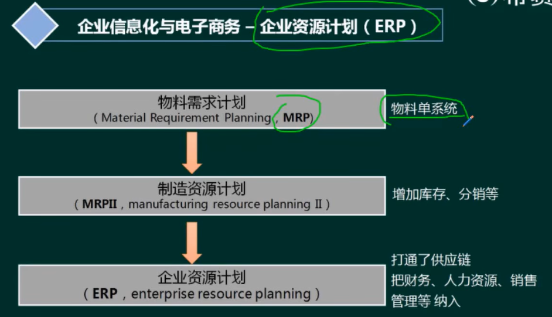

* 财会管理
    * 会计核算
    * 财务管理
* 生产控制管理
    * 主生产计划
    * 物料需求计划
    * 能力需求计划
    * 车间控制
    * 制造标准
* 人力资源管理
    * 人力资源规划
    * 招聘管理
    * 工资核算
    * 工时管理
    * 差旅费核算
* 物流管理
    * 分销管理
    * 采购管理
    * 库存控制

## 企业信息化与电子商务＋客户关系管理(CRM)

通过维护客户关系，让企业获得利益

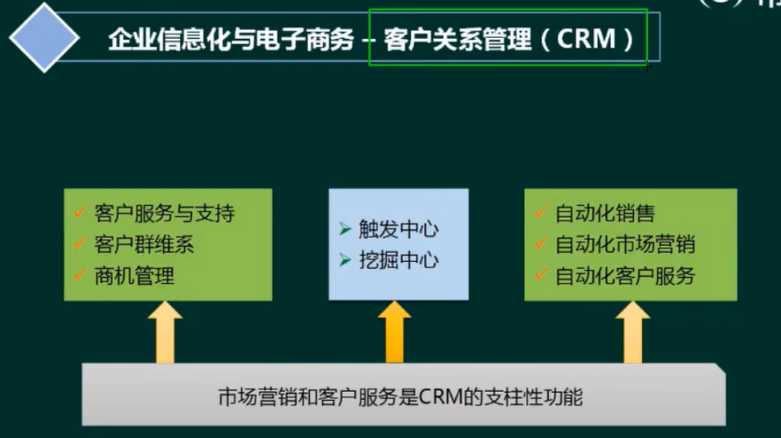

## 企业信息化与电子商务–供应链管理(SCM)

SCM理念∶强强联合，整合与优化“三流”，打通企业间“信息孤岛”，严格的数据交换标准。

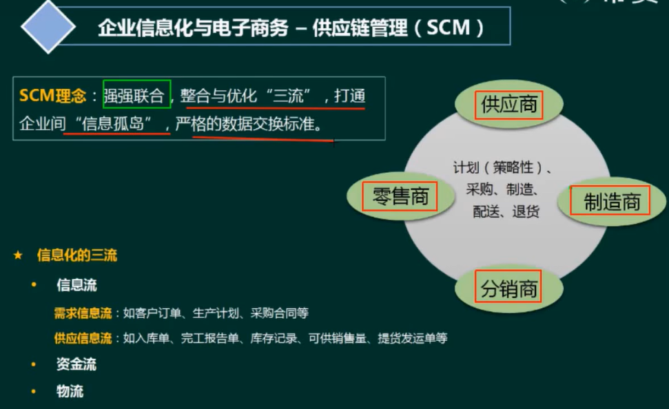

* 信息化的三流
    * 信息流(核心)
        * 需求信息流︰如客户订单、生产计划、采购合同等。
        * 供应信息流︰如入库单、完工报告单、库存记录、可供销售量、提货发运单等。
    * 资金流
    * 物流

## 企业信息化与电子商务–商业智能(BI)

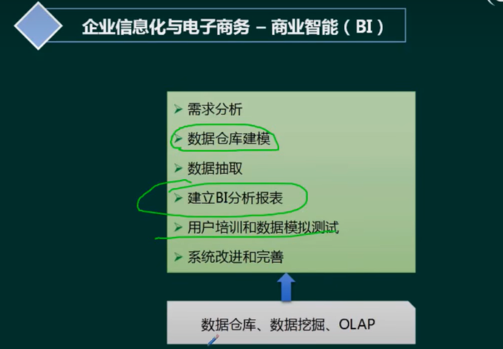

### 企业信息化与电子商务–数据仓库

* 数据仓库的特点∶
    * **面向主题**:数据按主题组织。
    * **集成的**:消除了源数据中的不一致性，提供整个企业的一致性全局信息。
    * **相对稳定的(非易失的)︰主要进行查询操作，只有少量的修改和删除操作（或是不删除)**。
    * **反映历史变化(随着时间变化)**:记录了企业从过去某一时刻到当前各个阶段的信息，可对发展历程和未来趋势做定量分析和预则。

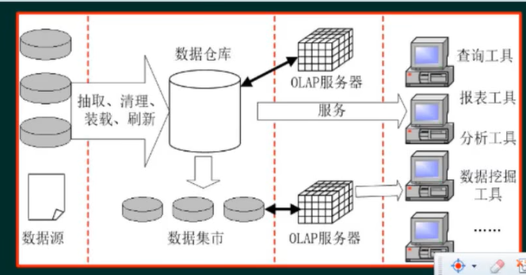

* OLAP: 联机分析处理
* OLTP: 联机事务处理

### 企业信息化与电子商务–数据挖掘

* 方法
    * 决策树（构建树结构进行分析)
    * 神经网络（类似统计学中的判别、回归、聚类等功能)
    * 遗传算法(三个基本过程︰繁殖（选择)、交叉（重组)、变异(突变）)关联规则挖掘算法（关联规则是描述数据之间存在关系的规则)

* 分类
    * 关联分析︰挖掘出隐藏在数据间的相互关系。
    * 序列模式分析:侧重点是分析数据间的前后关系（因果关系)。
    * 分类分析:为每一个记录赋予一个标记再按标记分类。
    * 聚类分析:分类分析法的逆过程。

### 企业信息化与电子商务–数据湖

数据湖是一个存储企业的各种各样原始数据的大型仓库，其中的数据可供存取、处理、分析及传输。

数据湖从企业的多个数据源获取原始数据，并且针对不同的目的，同一份原始数据还可能有多种满足特定内部模型格式的数据副本。
因此，数据湖中被处理的数据可能是任意类型的信息，**从结构化数据到完全非结构化数据**。

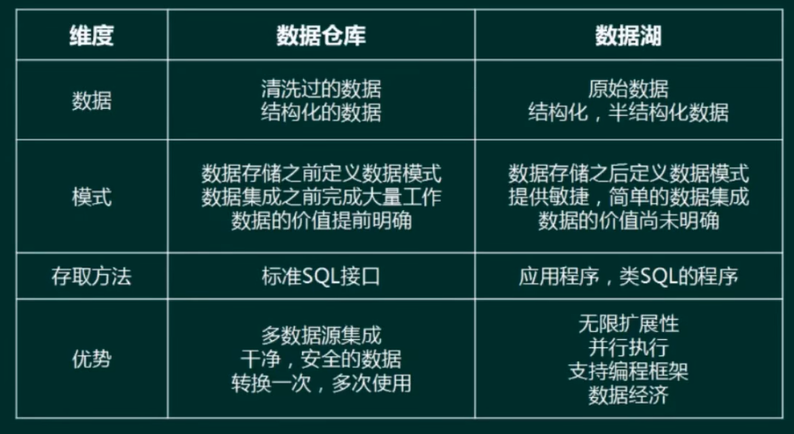

* 数据库仓库是经历过**数据清洗过的数据，是一种结构化的数据**
* 数据湖是**原始数据结构化，半结构化数据**

## 企业信息化与电子商务–决策支持系统(DSS)

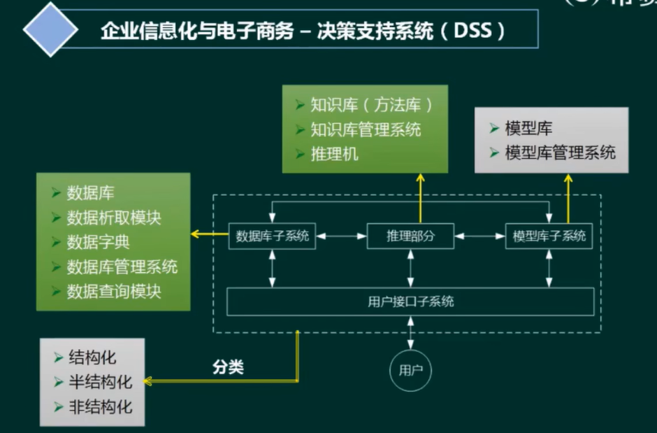

## 企业信息化与电子商务-业务流程重组(BPR)

BPR是对企业的业务流程**进行根本性的再思考和彻底性的再设计**，从而获得可以用诸如成本、质量、服务和速度等方面的业绩来衡量的显著性的成就。

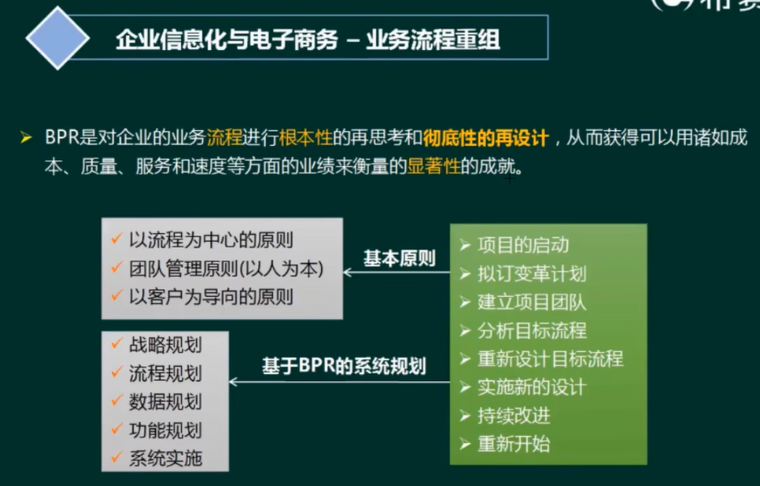

## 企业信息化与电子商务-业务流程管理(BPM)

BPM是一种**以规范化的构造端到端的卓越业务流程为中心**，以持续的提高组织业务绩效为目的的系统化方法。

* PDCA闭环的管理过程(戴明环-质量管理工具)
    * 明确业务流程所欲获取的成果
    * 开发和计划系统的方法，实现以上成果
    * 系统地部署方法，确保全面实施
    * 根据对业务的检查和分析以及持续的学习活动，评估和审查所执行的方法。并进一步提出计划和实施改进措施

1. BPM与BPR管理思想最根本的不同就在于流程管理并不要求对所有的流程进行再造。构造卓越的业务流程并不是流程再造，而是根据现有流程的具体情况，对流程进行规范化的设计。
2. 流程管理包含三个层面:规范流程、优化流程和再造流程

# 六、企业门户

* 企业网站:注重单向信息传递，缺互动。
* 企业信息门户(EIP)︰把各种应用系统、数据资源和互联网资源统一集成到企业门户之下。
* 企业知识门户(EKP)∶企业网站的基础上增加知识性内容。
* 企业应用门户(EAP)︰实际上是对企业业务流程的集成。它以业务流程和企业应用为核心，把业务流程中功能不同的应用模块通过门户技术集成在一起。
* 企业通用门户:集以上四者于一身。

# 七、企业应用集成

1. 界面集成∶把各应用系统的界面集成起来，统一入口，产生“整体”感觉。
2. 数据集成︰数据集成是应用集成和业务过程集成的基础。把不同来源、格式、特点性质的数据在逻辑上或物理上有机地集中，从而为企业提供全面的数据共享。ETL、数据仓库、联邦数据库都可视为数据集成。
3. 控制集成（功能集成、应用集成）∶业务逻辑层次集成，可以借助于远程过程调用或远程方法调用、面向消息的中间件等技术。
4. 业务流程集成(过程集成)︰进行业务流程集成时，企业必须对各种业务信息的交换进行定义、授权和管理，以便改进操作、减少成本、提高响应速度。

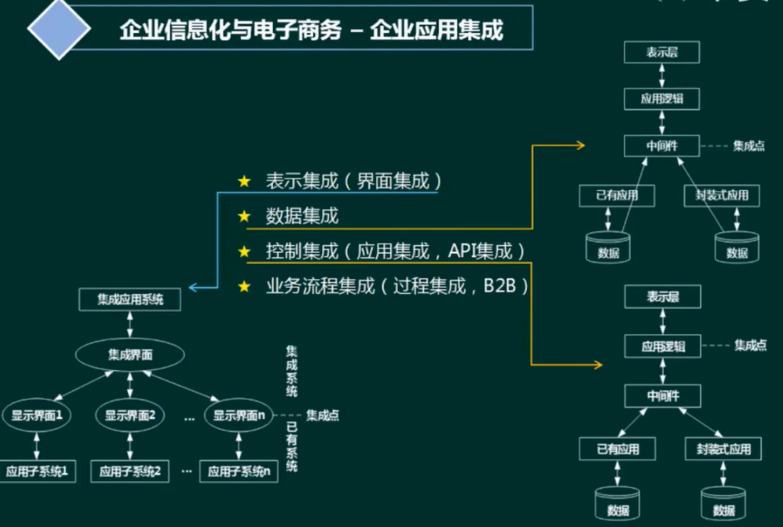

* 消息集成:**适用于数据量小、但要求频繁地、立即地、异步地数据交换场合**。
* 共享数据库∶**实时性强、可以频繁交互，数据的交换属于同步方式**。
* 文件传输:**适用于数据量大、交换频度小、即时性要求低的情况**。

# 八、企业信息化战略与实施练习题

1. 商业智能是指利用数据挖掘、知识发现等技术分析和挖掘结构化的、面向特定领域的存储与数据仓库的信息。它可以帮助用户认清发展趋势、获取决策支持并得出结论。
以下_( 1)_活动，并不属于商业智能范畴。(**B**)
* A.某大型购物网站通过分析用户的购买历史记录，为客户进行商品推荐
* B.某大型企业查询数据仓库中某种产品的总体销售数量
* c.某大型企业通过对产品销售数据进行挖掘，分析客户购买偏好
* D.某银行通过分析大量股票交易的历史数据，做出投资决策

分析：数据库是查询功能，不涉及到只能分析过程。数据库主要是做高并发的事务处理（OLTP） 数据仓库主要是做决策分析（OLAP） 商业只能大数据 数据挖掘等分析准备

2. 企业应用集成通过采用多种集成模式构建统一标准的基础平台，将具有不同功能和目的且独立运行的企业信息系统联合起来。其中，
面向_(2)_的集成模式强调**处理不同应用系统之间的交互逻辑，与核心业务逻辑相分离，并通过不同应用系统之间的协作共同完成某项业务功能**。(**C**)
* A．数据
* B﹒接口
* C. 过程
* D．界面

3. 某大型公司欲开发一个门户系统，该系统以商业流程和企业应用为核心，将商业流程中不同的功能模块通过门户集成在一起，
以提离公司的集中贸易能力、协同能力和信息管理能力。根据这种需求，采用企业_( 4)_门户解决方案最为合适。(**C**)
* A.信息
* B.知识
* c.应用
* D.垂直

4. 客户关系管理(CRM)系统将市场营销的科学管理理念通过信息技术的手段集成在软件上，能够帮助企业构建良好的客户关系。以下关于CRM系统的叙述中，错误的是_(5)_。(**C**)
* A.销售自动化是CRM系统中最基本的模块。
* B.营销自动化作为销售自动化的补充，包括营销计划的编制和执行、计划结果分析等。
* c.CRM系统能够与ERP系统在财务、制造、库存等环节进行连接，但两者关系相对松散，一般不会形成闭环结构。
* D.客户服务与支持是CRM系统的重要功能。目前，客户服务与支持的主要手段是通过呼叫中心和互联网来实现。

5. 共享数据库是一种重要的企业应用集成方式。以下关于共享数据库集成方式的叙述中，错误的是_( 6 )_.( **B** )
* A.共享数据库集成方式通常将应用程序的数据存储在一个共享数据库中，通过制定统一的数据库模式来处理不同应用的集成需求。
* B.共享数据库为不同的应用程序提供了统一的数据存储与格式定义，能够解决不同应用程序中数据语义不一致的问题（语义层面的东西不能通过数据库解决数据不一致性问题）
* C.多个应用程序可能通过共享数据库频繁地读取和修改相同的数据，这会使共亨数据库成为一个性能瓶颈。
* D.共享数据库集成方式的一个重要限制来自外部的已封装应用，这些封装好的应用程序只能采用自己定义的数据库模式，调整和集成余地较小。

6. 某大型商业公司欲集成其内部的多个业务系统，这些业务系统的运行平台和开发语言差异较大，而且系统所使用的通信协议和数据格式各不相同│针对这种情况，采用基于_(7)_的集成框架较为合适。
除此以外，集成系统还需要根据公司的新业务需要，灵活、动态地定制系统之间的功能协作关系，针对这一需求，应该选择基于_(8）_技术的实现方式更为合适。( **C** )(**D**)

* A.数据库  B．文件系统 C.总线 D．点对点一
* A.分布式对象 B.远程过程调用 C.进程间通信 D.工作流

7. 企业战略数据模型可分为两种类型:__(9)_描述日常事务处理中的数据及其关系;_( 10)_描述企业管理决策者所需信息及其关系。(**B**)( **C** )

* A﹒元数据模型 B.数据库模型 C.数据仓库模型 D.组织架构模型
* A.元数据模型 B .数据库模型 C.数据仓库模型 D.组织架构模型

8. 运用信息技术进行知识的挖掘和_( 11)_的管理是企业信息化建设的重要活动。( **A** )

* A.业务流程
* B.IT基础设施
* c.数据架构
* D.规章制度

9. 以下关于企业信息化方法的叙述中，正确的是_(12 )_。( **D** )
* A.业务流程重构是对企业的组织结构和工作方法进行重新设计，SCM（供应链管理)是一种重要的实现手段
* B.在业务数量浩繁且流程错综复杂的大型企业里，主题数据库方法往往形成许多“信息孤岛”，造成大量的无效或低效投资
* C.人力资源管理把企业的部分优秀员工看作是一种资本，能够取得投资收益’
* D.围绕核心业务应用计算机和网络技术是企业信息化建设的有效途径

10. 企业信息资源集成管理的前提是对企业_( 13)_的集成，其核心是对企业_( 14 )_的集成。( **A** )( **D** )
* A.信息功能 B.信息设施 C．信息活动 D.信息处理
* A.业务流 B.内部信息流 C.外部信息流 D.内部和外部信息流

集成管理是企业信息资源管理的主要内容之一。实行企业信息资源集成的前提是对企业历史上形成的企业信息功能的集成，
其核心是对企业内部和外部信息流的集成，其实施的基础是各种信息手段的集成。通过集成管理实现企业信息系统各要素的优化组合，
使信息系统各要素之间形成强大的协同作用，从而最大限度地放大企业信息的功能，实现企业可持续发展的目的。

11. 为了加强对企业信息资源的管理，企业应按照信息化和现代化企业管理要求设置信息管理机构，建立信息中心。信息中心的主要职能不包括_( 15)_。(**C**)
* A.处理信息，确定信息处理的方法+
* B.用先进的信息技术提高业务管理水平
* C.组织招聘信息资源管理员
* D.建立业务部门期望的信息系统和网络

为了加强对企业信息资源的管理，企业应按照信息化和现代化企业管理要求设置信息管理机构，建立信息中心，确定信息主管，统一管理和协调企业信息资源的开发、收集和使用。
信息中心是企业的独立机构，直接由最高层领导并为企业最高管理者提供服务。其主要职能是处理信息，确定信息处理的方法，用先进的信息技术提高业务管理水平，
建立业务部门期望的信息系统和网络并预测未来的信息系统和网络，培养信息资源的管理人员等。

12. 企业信息化涉及到对企业管理理念的创新，按照市场发展的要求，对企业现有的管理流程重新整合，管理核心从对_( 16)_的管理，转向对_( 17 )_的管理，
并延伸到对企业技术创新、工艺设计、产品设计、生产制造过程的管理，进而还要扩展到对_( 18)_的管理乃至发展到电子商务。(**C**)( **D** )(**A** )

* A.人力资源和物资  B ﹒信息技术和知识  C .财务和物料 D.业务流程和数据
* A.业务流程和数据  B﹒企业信息系统和技术 C .业务流程、数据和接口  D.技术、物资和人力资源
* A.客户关系和供应链  B .信息技术和知识  C.生产技术和信息技术  D﹒信息采集、存储和共享

管理科学的核心就是应用科学的方法实施管理，按照市场发展的要求，对企业现有的管理流程重新整合，从作为管理核心的财务、物料管理，向技术、物资、人力资源的管理，
并延伸到企业技术创新、工艺设计、产品设计、生产制造过程的管理，进而扩展到客户关系管理、供应链的管理乃至发展电子商务，形成企业内部向外部扩散的全方位管理。
企业信息化注重企业经营管理方面的信息分析和研究，信息系统所蕴含的管理思想也可帮助企业建立更为科学规范的管理运作体系，提供准确及时的管理决策信息。

13. 企业信息集成按照组织范围分为企业内部的信息集成和盼部的信息集成。在企业内部的信息集成中，_( 19)_实现了不同系统之间的互操作，
使得不同系统之间能够实现数据和方法的共享:_(20）_实现了不同应用系统之间的连接、协调运作和信息共享。( **C** )( **D** )

* A.技术平台集成 B．数据集成 C.应用系统集成 D .业务过程集成
* A .技术平台集成 B .数据集成 D.业务过程集成 c.应用系统集成

14. 企业信息化一定要建立在企业战略规划基础之上，以企业战略规划为基础建立的企业管理模式是建立_(21)_的依据。(**A**)
* A.企业战略数据模型
* B．企业业务运作模型
* C.企业信息系统架构
* D.企业决策支持

15. 集成平台是支持企业信息集成的支撑环境，包括硬件、软件、软件工具和系统。集成平台的基本功能中，_( 22)_实现不同数据库系统之间的数据交换、
互操作、分布数据管理和共享信息模型定义;_( 23)_能够为应用提供数据交换和访问操作，使各种不同的系统能够相互协作。( **B** )( **C** )

* A .数据通信服务  B﹒信息集成服务  C.应用集成服务  D﹒操作集成服务
* A .数据通信服务  B.信息集成服务  C.应用集成服务  D.操作集成服务

集成平台是支持企业集成的支撑环境，包括硬件、软件、软件工具和系统，通过集成各种企业应用软件形成企业集成系统。由于硬件环境和应用软件的多样性，企业信息系统的功能和环境都非常复杂，
因此，为了能够较好地满足企业的应用需求，作为企业集成系统支持环境的集成平台，其基本功能主要有:
1. 通信服务︰它提供分布环境下透明的同步Ⅰ异步通信服务功能，使用户和应用程序无需关心具体的操作系统和应用程序所处的网络物理位置，而以透明的函数调用或对象服务方式完成它们所需的通信服务要求。
2. 信息集成服务︰它为应用提供透明的信息访问服务，通过实现异种数据库系统之间数据的交换、互操作、分布数据据管理和共享信息模型定义（或共享信息数据库的建立），使集成平台上运行的应用、服务或用户端能够以一致的语义和接口实现对数据（数据库、数据文件、应用交互信息.）的访问与控制。
3. 应用集成服务︰它通过高层应用编程接口来实现对相应应用程序的访问，这些高层应用编程接口包含在不同的适配器或代理中，它们被用来连接不同的应用程序。这些接口以函数或对象服务的方式向平台的组件模型提供信息，使用户在无需对原有系统进行修改（不会影响原有系统的功能）的情况下，只要在原有系统的基础上加上相应的访问接口就可以将现有的、用不同的技术实现的系统互联起来、通过为应用提供数据交换和访问操作，使各种不同的系统能够相互协作。
4. 二次开发工具∶二次开发工具是集成平台提供的一组帮助用户开发特定应用程序（如实现数据转换的适配器或应用封装服务等)的支持工具，其目的是简化用户在企业集成平台实施过程中（特定应用程序接口)的开发工作。
5. 平台运行管理工具∶它是企业集成平台的运行管理和控制模块，负责企业集成平台系统的静态和动态配置、集成平台应用运行管理和维护、事件管理和出错管理等。通过命名服务、目录服务、平台的动态静态配置，以及其中的关键数据的定期备份等功能来维护整个服务平台的系统配置及稳定运行。