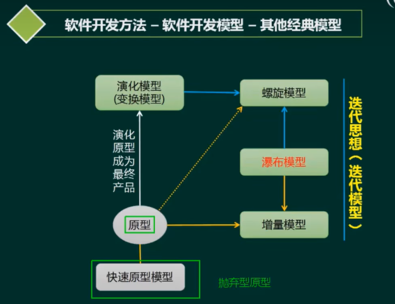

# 软件工程

---
1. 软件开发方法
   - 1.1 软件开发方法
   - 1.2 软件开发模型
   - 1.3 逆向工程
   - 1.4 净室软件工程
2. 需求工程

3. 软件系统建模

4. 系统设计

5. 测试与评审

6. 系统运行与软件维护

---
# 一、软件开发方法

## 1.1 软件开发方法

### 结构化法
面向过程设计
* 用户至上
* 严格区分工作阶段，每阶段有任务与成果
* 强调系统开发过程的整体性和全局性
* 系统开发过程工程化，文档资料标准化
* 自顶向下，逐步分解(求精)

### 原型法
用于需求分析阶段 是一个demo。常用于敏捷开发模式常用的方法。
* 适用于需求不明确的开发
* 包括抛弃型原型和进化型原型

### 面向对象方法

* 更好的复角性
* 关键在于建立一个全面、合理、统一的模型分析、设计、实现三个阶段，界限不明确

### 面向服务的方法

* SO方法有三个主要的抽象级别∶操作、服务、业务流程
* SOAD分为三个层次︰基础设计层（底层服务构件）、应用结构层（服务之间的接口和服务级协定）和业务组织层(业务流程建模和服务流程编排)
* 服务建模:分为服务发现、服务规约和服务实现三个阶段

## 1.2 软件开发模型

| 模型          |        特点        |
|:------------|:----------------:|
| **瀑布模型**    |   迭代模型/迭代开发方法    |
| 演化模型        |      快速应用开发      |
| 增量模型        | 构件组装模型/基于构件的开发方法 |
| **螺旋模型**    |   **统一过程/统一开发方法**    |
| **原型模型**    |    **敏捷开发方法**    |
| 喷泉模型        |    模型驱动的开发方法     |
| V模型         |  **基于架构的开发方法**   |

### 瀑布模型

适合于需求明确的项目(需求不会有大的改动)，在实际的开发中添加原型模式来构建，这样有利于开发的成功率，及时调整用户需求。

### 原型模型

### 螺旋模型

螺旋模型引入了风险分析，通常用于大型模型

### V模型

测试左移，UT--CT--CI--ST--MT

### 构建组装模型

