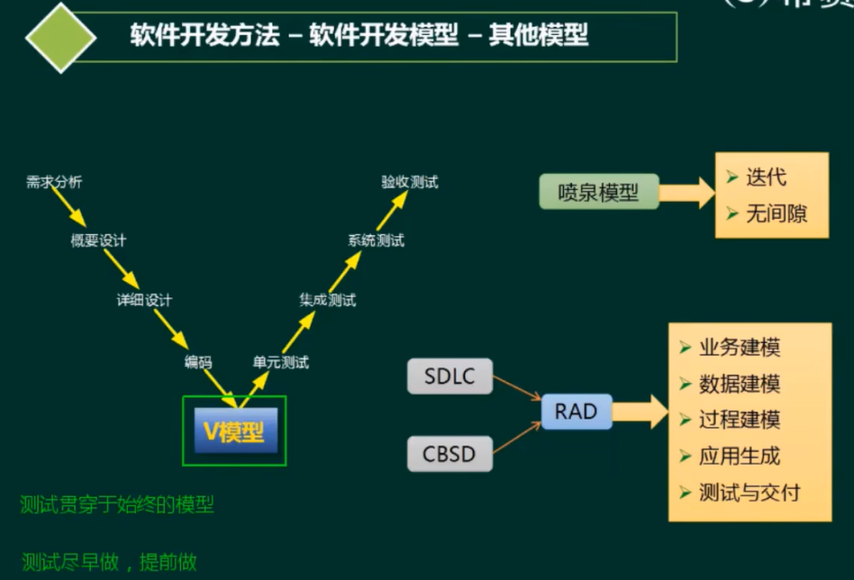

# 软件开发方法与需求分析

---
1. 软件开发方法
   - 1.1 软件开发方法
   - 1.2 软件开发模型
   - 1.3 逆向工程
   - 1.4 净室软件工程
2. 需求工程
   - 2.1 需求获取
   - 2.2 需求分析
   - 2.3 UML图
   - 2.4 UML4+1视图
   - 2.5 UML关系

3. 软件系统建模

4. 系统设计

5. 测试与评审

6. 系统运行与软件维护

---
# 一、软件开发方法

## 1.1 软件开发方法

### 结构化法
面向过程设计
* 用户至上
* 严格区分工作阶段，每阶段有任务与成果
* 强调系统开发过程的整体性和全局性
* 系统开发过程工程化，文档资料标准化
* 自顶向下，逐步分解(求精)

### 原型法
用于需求分析阶段 是一个demo。常用于敏捷开发模式常用的方法。
* 适用于需求不明确的开发
* 包括抛弃型原型和进化型原型

### 面向对象方法

* 更好的复角性
* 关键在于建立一个全面、合理、统一的模型分析、设计、实现三个阶段，界限不明确

### 面向服务的方法

* SO方法有三个主要的抽象级别∶操作、服务、业务流程
* SOAD分为三个层次︰基础设计层（底层服务构件）、应用结构层（服务之间的接口和服务级协定）和业务组织层(业务流程建模和服务流程编排)
* 服务建模:分为服务发现、服务规约和服务实现三个阶段

## 1.2 软件开发模型

| 模型          |        特点        |
|:------------|:----------------:|
| **瀑布模型**    |   迭代模型/迭代开发方法    |
| 演化模型        |      快速应用开发      |
| 增量模型        | 构件组装模型/基于构件的开发方法 |
| **螺旋模型**    |   **统一过程/统一开发方法**    |
| **原型模型**    |    **敏捷开发方法**    |
| 喷泉模型        |    模型驱动的开发方法     |
| V模型         |  **基于架构的开发方法**   |

### 瀑布模型

适合于需求明确的项目(需求不会有大的改动)，在实际的开发中添加原型模式来构建，这样有利于开发的成功率，及时调整用户需求。

### 原型模型

### 螺旋模型

螺旋模型引入了风险分析，通常用于大型模型

### V模型

测试左移，UT--CT--CI--ST--MT

### 构建组装模型

### 统一过程模型
驱动用例、以架构为中文、迭代和增量

1. 初始
  * 确定项目范围和边界
  * 识别系统的关键用例
  * 展示系统的侯选架构
  * 估计项目费用和时间
  * 评估项目风险

2. 细化
  * 分析系统问题领域
  * 建立软件架构基础
  * 淘汰最高风险元素

3. 构建
  * 开发剩余的构件
  * 构件组装与测试

4. 交付
   * 进行β测试
   * 制作发布版本
   * 用户文档定稿
   * 确认新系统
   * 培训、调整产品

### 敏捷模型

适合小型项目的开发，具有自适应、水晶方法、特征驱动开发、极限编程。
特点：
* 短平快的会议
* 小型版本发布
* 较少的文档
* 合作为重
* 客户直接参与
* 自动化测试
* 适应性计划调整
* 结对编程
* 测试驱动开发
* 持续集成
* 重构

## 1.3 逆向工程

1. 实现级︰包括程序的抽象语法树、符号表、过程的设计表示
2. 结构级︰包括反映程序分量之间相互依赖关系的信息，例如调用图、结构图、程序和数据结构
3. 功能级︰包括反映程序段功能及程序段之间关系的信息，例如数据和控制流模型
4. 领域级︰包括反映程序分量或程序诸实体与应用领域概念之间对应关系的信息，例如实体关系模型

## 1.4 净室软件工程

1. 净室即无尘室、洁净室。也就是一个受控污染级别的环境。
2. 使用盒结构规约（或形式化方法）进行分析和设计建模，并且强调将正确性验证，而不是测试，作为发现和消除错误的主要机制。
3. 使用统计的测试来获取认证被交付的软件的可靠性所必需的出错率信息。

# 二、需求工程

1. 软件需求是指用户对系统在功能、行为、性能、设计约束等方面的期望。
2. 软件需求是指用户解决问题或达到目标所需的条件或能力，是系统或系统部件要满足合同、标准、规范或其他正式规定文档所需具有的条件或能力，以及反映这些条件或能力的文档说明。

**需求开发**
  * 需求获取
  * 需求分析
  * 需求定义
  * 需求验证

**需求管理**
  * 变更控制
  * 版本控制
  * 需求跟踪
  * 需求状态跟踪

## 2.1 需求获取

## 2.2 需求分析

* **实体类**映射需求中的每个实体，实体类保存需要存储在永久存储体中的信息，例如，在线教育平台系统可以提取出学员类和课程类，它们都属于实体类。
* **控制类**是用于控制用例工作的类，一般是由动宾结构的短语（“动词+名词”或“名词+动词”)转化来的名词，例如，用例“身份验证”可以对应于一个控制类“身份验证器”，它提供了与身份验证相关的所有操作。
* **边界类**用于封装在用例内、外流动的信息或数据流。边界类位于系统与外界的交接处，包括所有窗体、报表、打印机和扫描仪等硬件的接口，以及与其他系统的接口。

## 2.3 UML图

1. 静态图(结构图)
   * 类图:一组类、接口、协作和它们之间的关系对象图:一组对象及它们之间的关系
   * 构件图:一个封装的类和它的接口
   * **部署图:软硬件之间映射**
   * 制品图∶系统的物理结构 
   * 包图:由模型本身分解而成的组织单元，以及他们之间的依赖关系
   * 组合结构图

2. 动态图(行为图)
   * **用例图:系统与外部参与者的交互**
   * **顺序图∶强调按时间顺序**
   * **通信图(协作图)**
   * 状态图:状态转换变迁
   * **活动图:类似程序流程图，并行行为**
   * 定时图∶强调实际时间
   * 交互概览图

## 2.4 UML4+1视图

## 2.5 UML关系

* 用例建模的流程:
    * 识别参与者（必须)
    * 合并需求获得用例(必须)
    * 细化用例描述（必须)
    * 调整用例模型（可选)

* 关系包括了:
    * 包含关系
    * 扩展关系
    * 泛化关系

* 包含关系∶其中这个提取出来的公共用例称为抽象用例，而把原始用例称为基本用例或基础用例系︰当可以从两个或两个以上的用例中提取公共行为时，应该使用包含关系来表示它们。
* 扩展关系:如果一个用例明显地混合了两种或两种以上的不同场景，即根据情况可能发生多种分支，则可以将这个用例分为一个基本用例和一个或多个扩展用例，这样使描述可能更加清晰。
* 泛化关系︰当多个用例共同拥有一种类似的结构和行为的时候，可以将它们的共性抽象成为父用例，其他的用例作为泛化关系中的子用例。在用例的泛化关系中，子用例是父用例的一种特殊形式，子用例继承了父用例所有的结构、行为和关系。

### 类与对象图

* 1∶表示一个集合中的一个对象对应另一个集合中1个对象。
* 0..*:表示一个集合中的一个对象对应另一个集合中的0个或多个对象。(可以不对应)
* 1..*∶表示一个集合中的一个对象对应另一个集合中的一个或多个对象。(至少对应一个)
* *:表示一个集合中的一个对象对应另一个集合中的多个的对象。

* 依赖关系一个事物发生变化影响另一个事物。
* 泛化关系:特殊/一般关系
* 关联关系︰描述了一组链，链是对象之间的连接。
* 聚合关系:整体与部分生命周期不同。
* 组合关系∶整体与部分生命周期相同。
* 实现关系︰接口与类之间的关系

### 顺序图

### 活动图

### 状态图

### 通信图

## 需求定义

1. 严格定义法:
    * 所有需求都能够被预先定义
    * 开发人员与用户之间能够准确而清晰地交流
    * 采用图形/文字可以充分体现最终系统

2. 原型法
    * 并非所有的需求都能在开发前被准确地说明
    * 项目参加者之间通常都存在交流上的困难
    * 需要实际的、可供用户参与的系统模型
    * 有合适的系统开发环境
    * 反复是完全需要和值得提倡的，需求一旦确定，就应遵从严格的方法

## 需求的验证

## 需求的管理

## 需求的跟踪

## 变更控制

