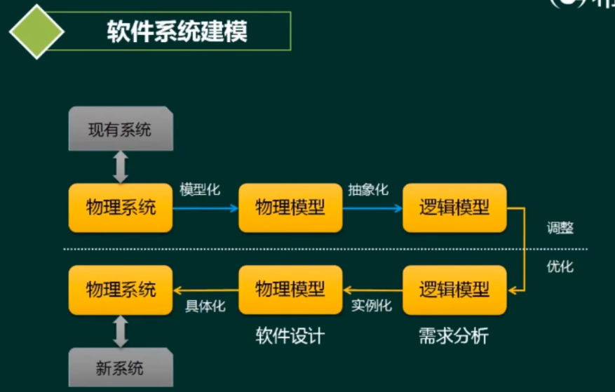
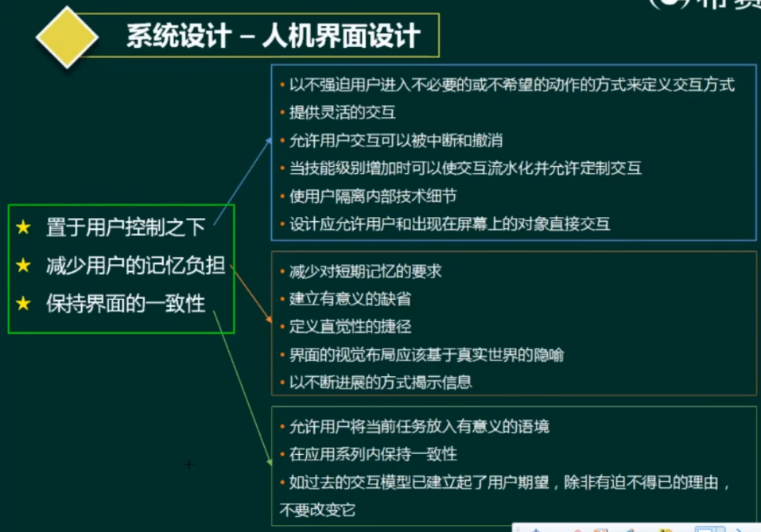
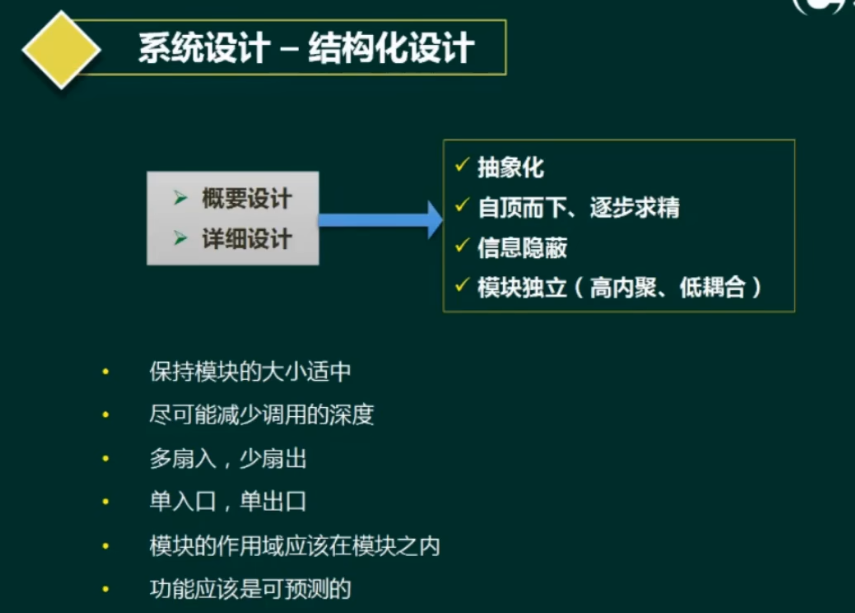
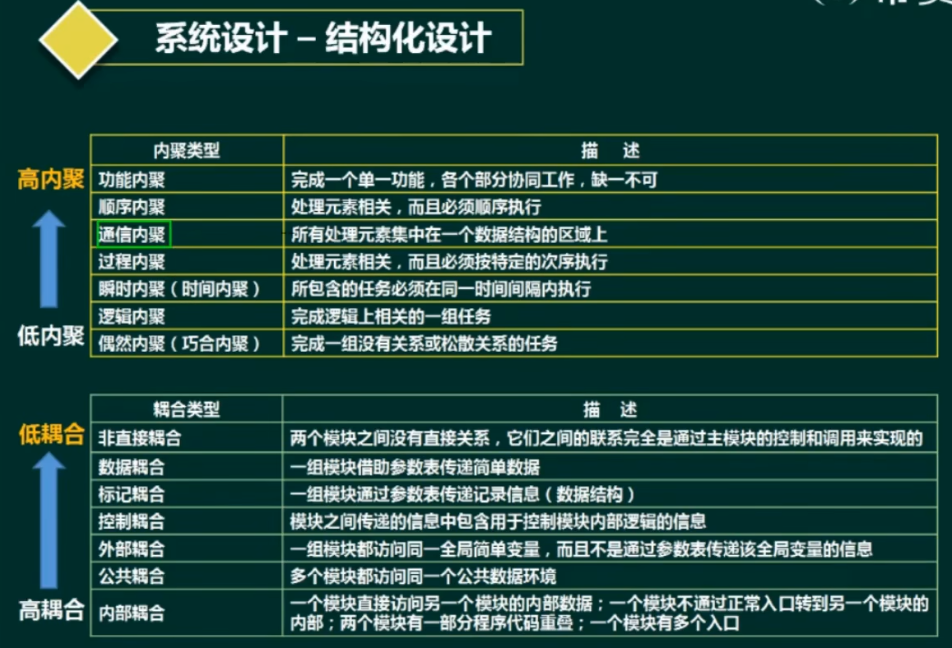

# 软件系统建模

## 软件系统建模流程

1. 结构化建模方法
结构化建模方法是以过程为中心的技术，可用于分析一个现有的系统以及定义新系统的业务需求。结构化建模方法所绘制的模型称为数据流图（DFD )。对于流程较为稳定的系统可考虑结构化建模方法。
2. 信息工程建模方法(或数据库建模方法)
信息工程建模方法是一种以数据为中心，但过程敏感的技术，它强调在分析和研究过程需求之前，首先研究和分析数据需求。信息工程建模方法所创建的模型被称为实体联系图(ERD )。主要用于数据建模。
3. 面向对象建模方法
面向对象建模方法将“数据”和“过程”集成到被称为“对象”的结构中，消除了数据和过程的人为分离现象。面向对象建模方法所创建的模型被称为对象模型。随着面向对象技术的不断发展和应用，形成了面向对象的建模标准，即UML（统一建模语言)。UML定义了几种不同类型的模型图，这些模型图以对象的形式共建一个信息系统或应用系统。目前比较常用的建模方法。

## 人机界面设计

## 结构化设计

