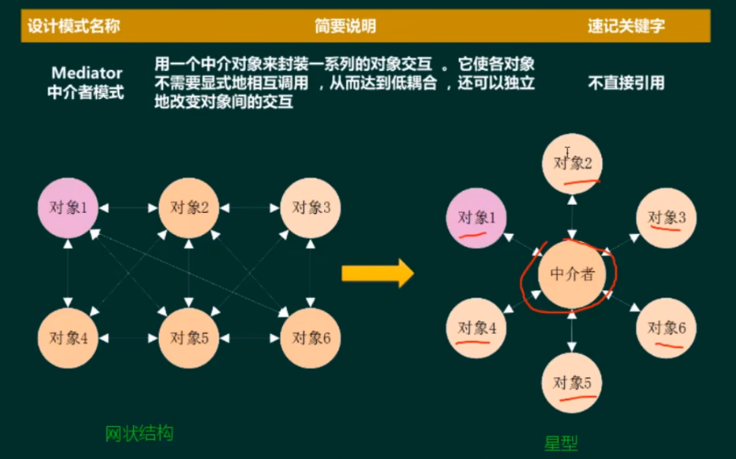

# 软件开发方法与需求分析

---
1. 面向对象的设计
    - 1.1 面向对象的设计原则
    - 1.2 面向对象的设计模式
    - 1.3 
    - 1.4 
2. 测试与评审
    - 2.1 
    - 2.2 
    - 2.3 
    - 2.4 
    - 2.5 

3. 系统运行与软件维护
    - 3.1 
    - 3.2 
    - 3.3 
   
---

# 一、面向对象设计

## 1.1 面向对象的设计原则

1. 单一职责原则∶设计目的单一的类
2. 开放-封闭原则∶对扩展开放，对修改封闭李氏(Liskov)
3. 替换原则:子类可以替换父类
4. 依赖倒置原则∶要依赖于抽象，而不是具体实现;**针对接口编程，不要针对实现编程接口**
5. 隔离原则︰使用多个专门的接口比使用单一的总接口要好
6. 组合重用原则︰要尽量使用组合，而不是继承关系达到重用目的
7. 迪米特(Demeter)原则(最少知识法则):一个对象应当对其他对象有尽可能少的了解

## 1.2 面向对象的设计模式

1. 架构模式︰软件设计中的高层决策，例如C/S结构就属于架构模式，架构模式反映了开发软件系统过程中所作的基本设计决策
2. 设计模式:主要关注软件系统的设计，与具体的实现语言无关
3. 惯用法︰是最低层的模式关注软件系统的设计与实现，实现时通过某种特定的程序设计语言来描述构件与构件之间的关系。每种编程语言都有它自己特定的模式，即语言的惯用法。例如引用-计数就是C++语言中的一种惯用法

## 1.3 创建性设计模式

### 工厂方法模式(Factory Method)
定义一个创建对象的接口，但由子类决定需要实例化哪一个类。工方法使得子类实例化的过程推迟(动态的产生对象)

### 抽象工厂模式(Abstract Factory)
提供一个接口，可以创建一系列相关或相互依赖的对象，而无需指定它们具体的类(生产系列对象)

### 构建器模式(Builder)
将一个复杂类的表示与其构造相分离，使得相同的构建过程能够得出不同的表示(复杂对象构建)

### 原型模式(Prototype)
用原型实例指定创建对象的类型，并且通过拷贝这个原型来创建新的对象(克隆对象)

### 单例模式(Singleton)
保证一个类只有一个实例，并提供一个访问它的全局访问点(单例对象)

## 1.4 结构性设计模式

### 适配器模式Adapter
将一个类的接口转换成用户希望得到的另一种接口。它使原本不相容的接口得以协同工作(转换接口)

### 桥接模式Bridge 
将类的抽象部分和它的实现部分分离开来，使它们可以独立地变化(继承树拆分)

### 组合模式Composite 
将对象组合成树型结构以表示“整体-部分”的层次结构，使得用户对单个对象和组合对象的使用具有一致性(树形目录结构)

### 装饰模式Decorator
动态地给一个对象添加一些额外的职责。它提供了用子类扩展功能的一个灵活的替代，比派生一个子类更加灵活(动态附加职责)

### 外观模式Facade
定义一个高层接口，为子系统中的一组接口提供一个一致的外观，从而简化了该子系统的使用(对外统一接口)

### 享元模式Flyweight
提供支持大量细粒度对象共享的有效方法(汉字编码)

### 代理模式Proxy
为其他对象提供一种代理以控制这个对象的访问(快捷方式)

## 1.4 行为设计模式

### 行为性模式

