# 软件开发方法与需求分析

---
1. 面向对象的设计
    - 1.1 面向对象的设计原则
    - 1.2 面向对象的设计模式
    - 1.3 创建性设计模式
    - 1.4 结构性设计模式
    - 1.5 行为设计模式
2. 软件测试与评审
    - 2.1 软件测试方法
    - 2.2 软件调试
3. 系统运行与软件维护
    - 3.1 
    - 3.2 
    - 3.3
---

# 一、面向对象设计

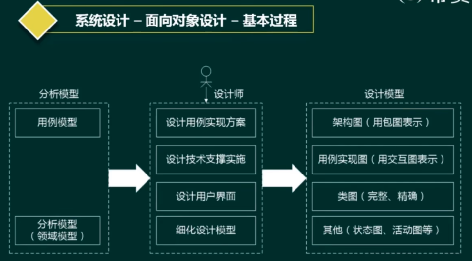

## 1.1 面向对象的设计原则

1. 单一职责原则∶设计目的单一的类
2. 开放-封闭原则∶对扩展开放，对修改封闭李氏(Liskov)
3. 替换原则:子类可以替换父类
4. 依赖倒置原则∶要依赖于抽象，而不是具体实现;**针对接口编程，不要针对实现编程接口**
5. 隔离原则︰使用多个专门的接口比使用单一的总接口要好
6. 组合重用原则︰要尽量使用组合，而不是继承关系达到重用目的
7. 迪米特(Demeter)原则(最少知识法则):一个对象应当对其他对象有尽可能少的了解

## 1.2 面向对象的设计模式

1. 架构模式︰软件设计中的高层决策，例如C/S结构就属于架构模式，架构模式反映了开发软件系统过程中所作的基本设计决策
2. 设计模式:主要关注软件系统的设计，与具体的实现语言无关
3. 惯用法︰是最低层的模式关注软件系统的设计与实现，实现时通过某种特定的程序设计语言来描述构件与构件之间的关系。每种编程语言都有它自己特定的模式，即语言的惯用法。例如引用-计数就是C++语言中的一种惯用法

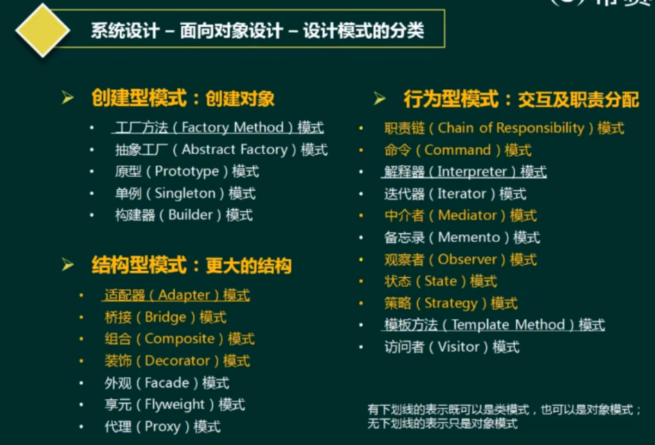

## 1.3 创建性设计模式

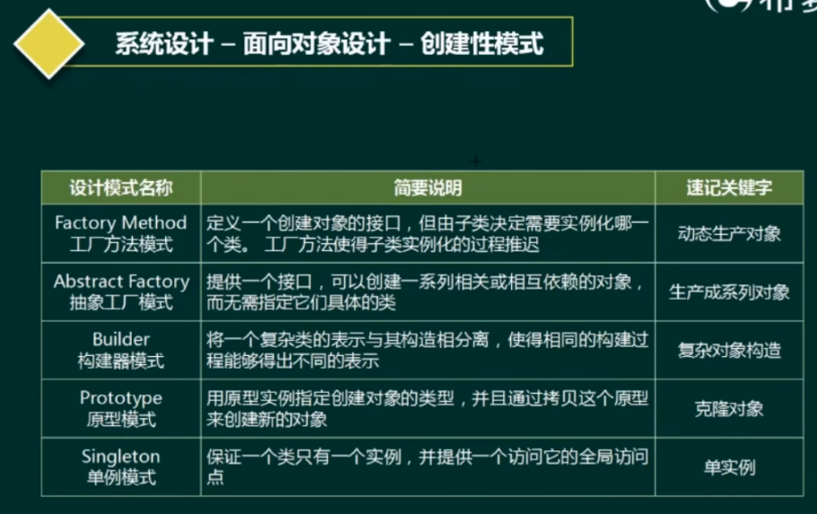

### 工厂方法模式(Factory Method)
定义一个创建对象的接口，但由子类决定需要实例化哪一个类。工方法使得子类实例化的过程推迟(动态的产生对象)

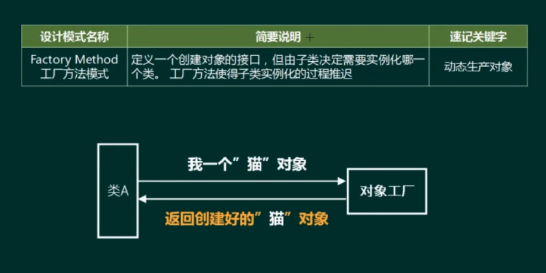

### 抽象工厂模式(Abstract Factory)
提供一个接口，可以创建一系列相关或相互依赖的对象，而无需指定它们具体的类(生产系列对象)

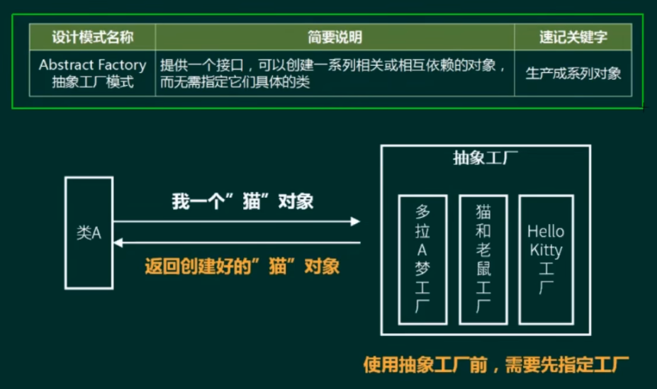

### 构建器模式(Builder)
将一个复杂类的表示与其构造相分离，使得相同的构建过程能够得出不同的表示(复杂对象构建)

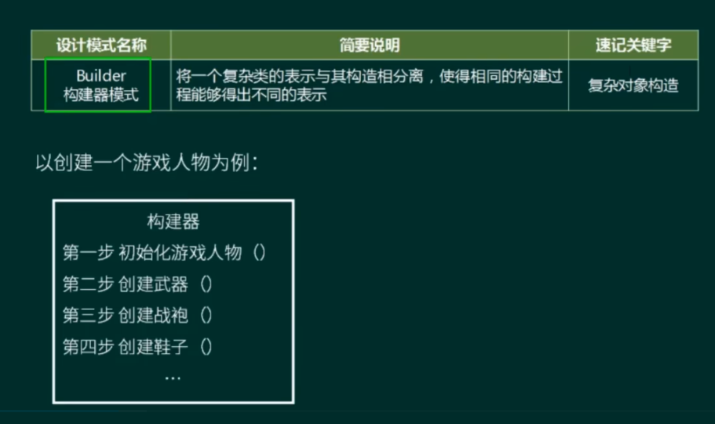

### 原型模式(Prototype)
用原型实例指定创建对象的类型，并且通过拷贝这个原型来创建新的对象(克隆对象)

### 单例模式(Singleton)
保证一个类只有一个实例，并提供一个访问它的全局访问点(单例对象)

## 1.4 结构性设计模式

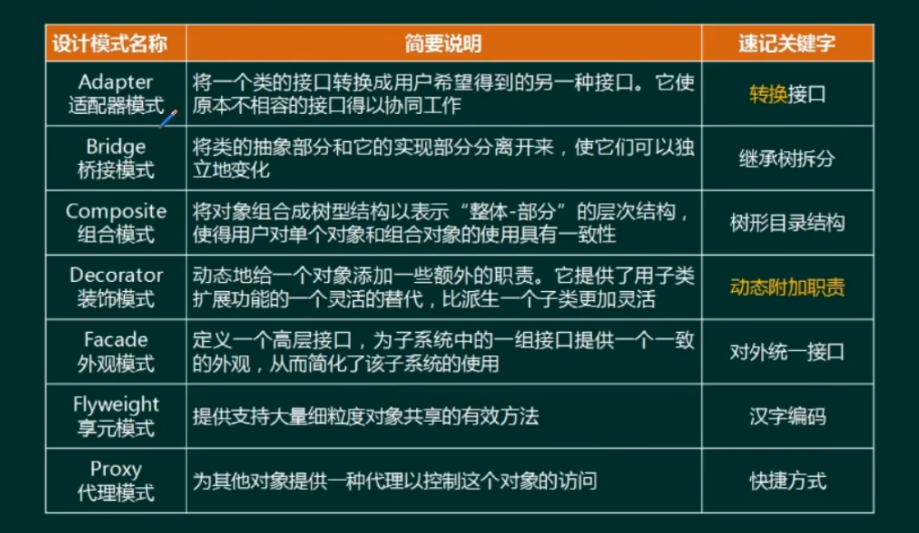

### 适配器模式Adapter
将一个类的接口转换成用户希望得到的另一种接口。它使原本不相容的接口得以协同工作(转换接口)

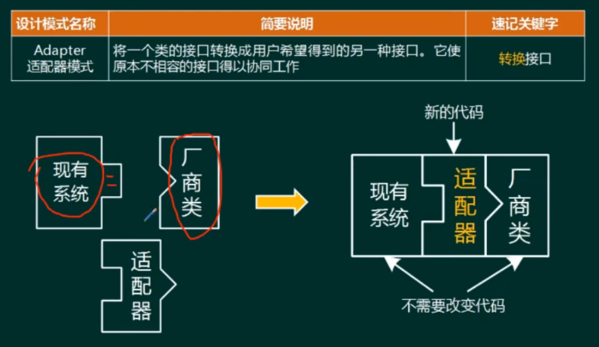

### 桥接模式Bridge 
将类的抽象部分和它的实现部分分离开来，使它们可以独立地变化(继承树拆分)

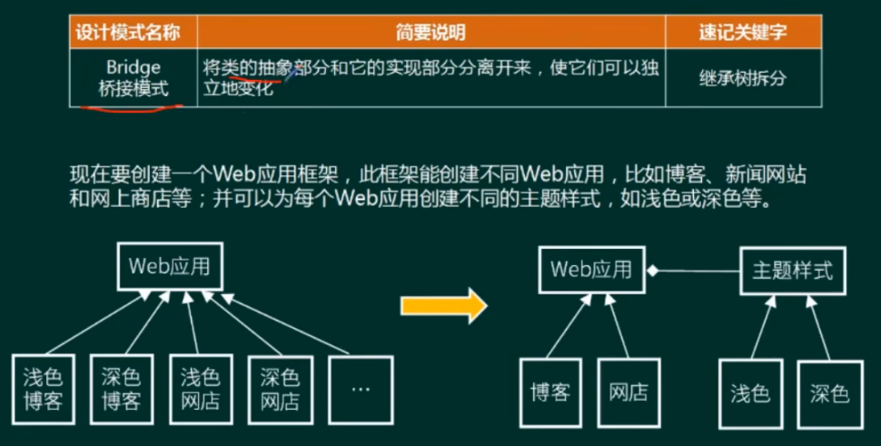

### 组合模式Composite 
将对象组合成树型结构以表示“整体-部分”的层次结构，使得用户对单个对象和组合对象的使用具有一致性(树形目录结构)

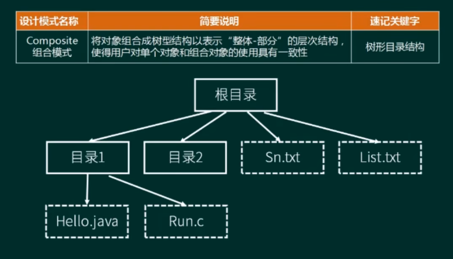

### 装饰模式Decorator
动态地给一个对象添加一些额外的职责。它提供了用子类扩展功能的一个灵活的替代，比派生一个子类更加灵活(动态附加职责)

### 外观模式Facade
定义一个高层接口，为子系统中的一组接口提供一个一致的外观，从而简化了该子系统的使用(对外统一接口)

### 享元模式Flyweight
提供支持大量细粒度对象共享的有效方法(汉字编码)

### 代理模式Proxy
为其他对象提供一种代理以控制这个对象的访问(快捷方式)

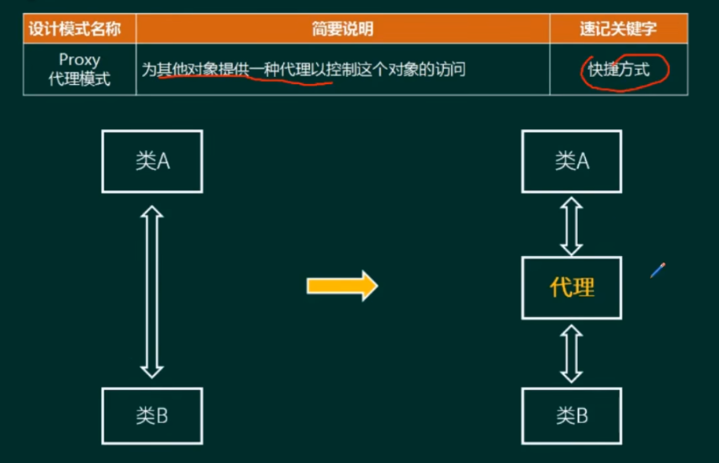

## 1.5 行为设计模式

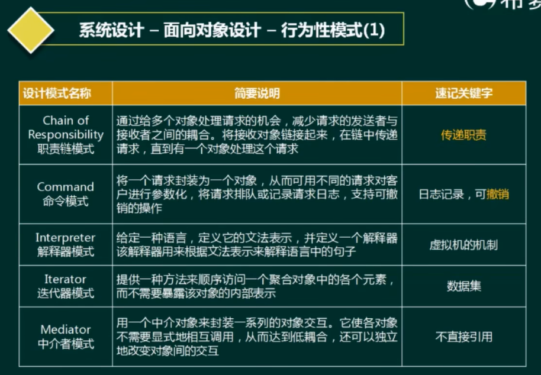

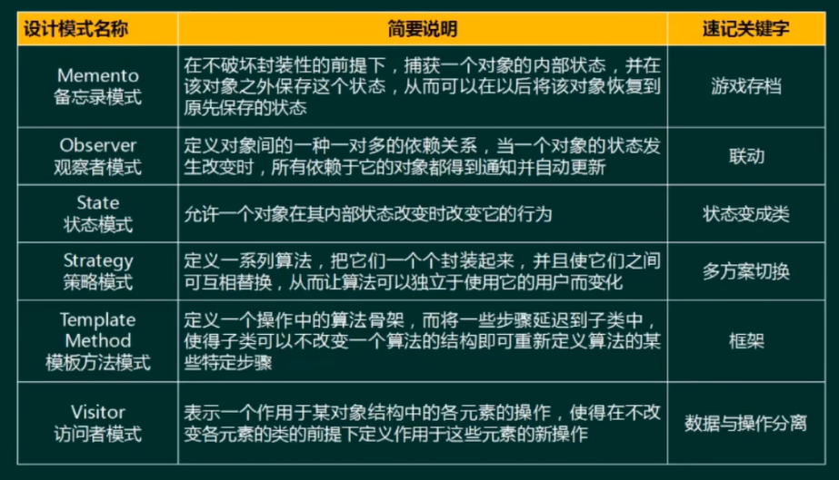

### 行为性模式
用一个中介对象来封装一系列的对象交互。它使各对象不需要显式地相互调用，从而达到低耦合，还可以独立地改变对象间的交互

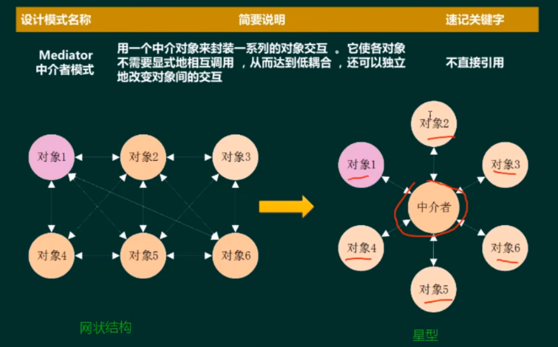

### 责任链模式
通过给多个对象处理请求的机会，减少请求的发送者与接收者之间的耦合。将接收对象链接起来，在链中传递请求，直到有一个对象处理这个请求

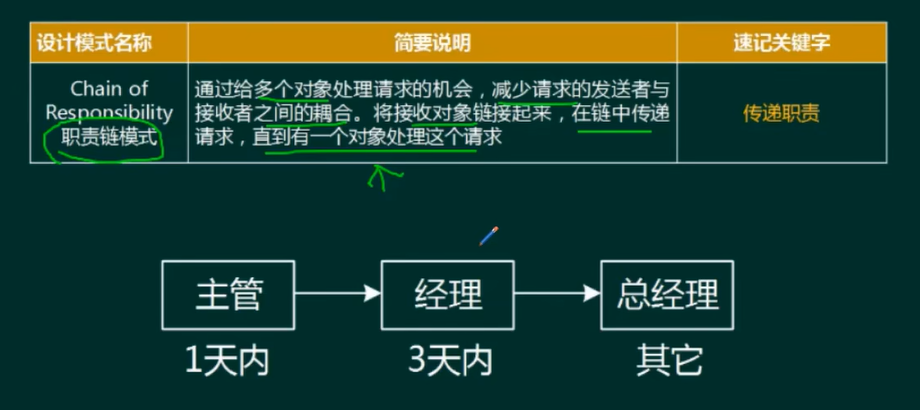

### 命令模式
将个请求封装为一个对象，从而可用不同的请求对客户进行参数化，将请求排队或记录请求日志，支持可撤销的操作

### 解释器模式
给定一种语言，定义它的文法表示，并定义一个解释器该解释器用来根据文法表示来解释语言中的句子

### 观察者模式
定义对象间的一种一对多的依赖关系，当一个对象的状态发生改变时，所有依赖于它的对象都得到通知并自动更新

### 策略模式
定义一系列算法，招它们一个个封装起来，并且使它们之间可互相替换，从而让算法可以独立于使用它的用户而变化

### 模板方法
定义一个操作中的算法骨架，而将一些步骤延迟到子类中，使得子类可以不改变一个算法的结构即可重新定义算法的某些特定步骤

### 访问者模式
表示一个作用于某对象结构中的各元素的操作，使得在不改变各元素的类的前提下定义作用于这些元素的新操作

# 二、软件测试与评审

## 2.1 软件测试方法

### 软件测试的类型

* 尽早、不断的进行测试(**测试左移**)。
* 程序员避免测试自己设计的程序（**但是单元测试还是需要自己写**）。
* 既要选择有效、合理的数据，也要选择无效、不合理的数据修改后应进行回归测试。（**修改一个bug 可能导致新的bug**）
* 尚未发现的错误数量与该程序已发现错误数成正比。

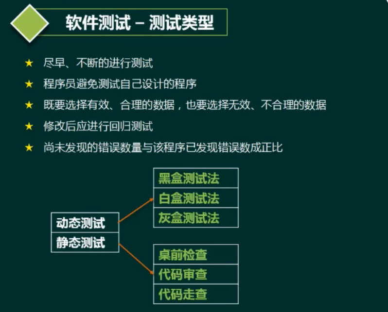

* 动态测试
  * 黑盒测试法
  * 白盒测试法
  * 灰盒测试法(白+黑)
* 静态测试
  * 桌前检查
  * 代码审查
  * 代码走查

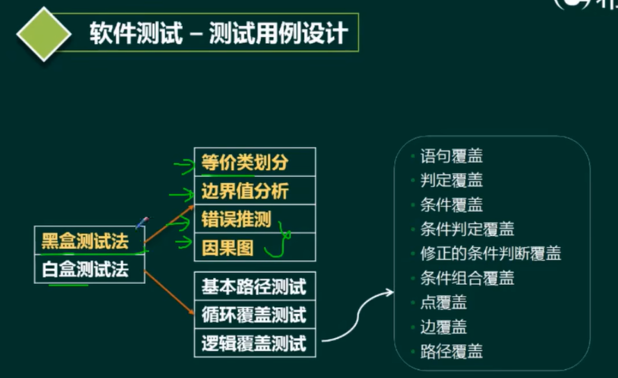

### 测试阶段

1. 单元测试︰模块测试，模块功能、性能、接口等集成测试︰模块间的接口
2. 确认测试:验证软件与需求的一致性。内部确认测试、Alpha测试、Beta测试，验收测试
3. 系统测试︰真实环境下，验证完整的软件配置项能否和系统正确连接。
4. 回归测试︰测试软件变更之后，变更部分的正确性对变更需求的符合性。

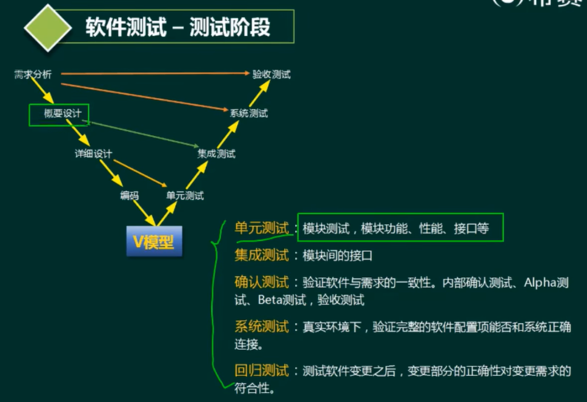

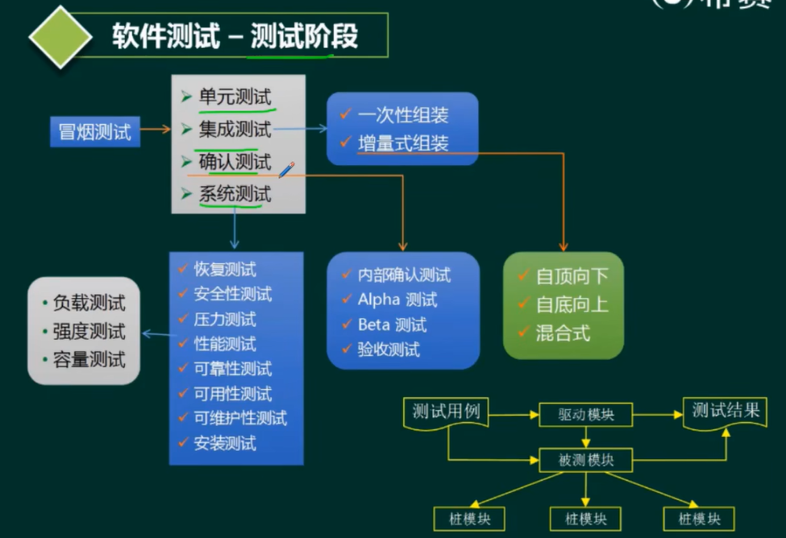

### 面向对象的测试

1. 算法层（单元测试）︰包括等价类划分测试、组合功能测试（基于判定表的测试)、递归函数测试和多态消息测试
2. 类层（模块测试）:包括不变式边界测试、模态类测试和非模态类测试
3. 模板层/类树层(集成测试）︰包括多态服务测试和展平测试
4. 系统层（系统测试)

## 2.2 软件调试方法

### 软件调试方法
1. 蛮力法:主要思想是“通过计算机找错”，低效，耗时
2. 回溯法︰从出错处人工沿控制流程往回追踪，直至发现出错的根源。复杂程序由于回溯路径多，难以实施
3. 原因排除法:主要思想是演绎和归纳，用二分法实现

### 软件调试与测试的区别
1. 测试的目的是找出存在的错误，而调试的目的是定位错误并修改程序以修正错误
2. 调试是测试之后的活动，测试和调试在目标、方法和思路上都有所不同
3. 测试从一个已知的条件开始，使用预先定义的过程，有预知的结果;调试从一个未知的条件开始，结束的过程不可预计
4. 测试过程可以事先设计，进度可以事先确定;调试不能描述过程或持续时间

