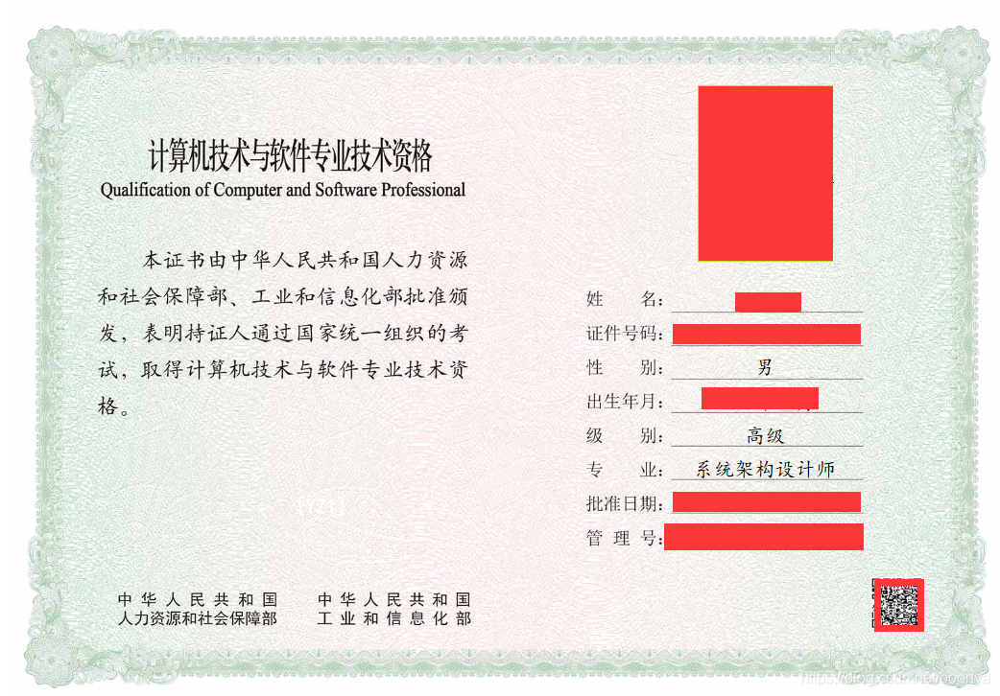

# <h1 align="center"> 系统软件架构师考试（高级） </h1>

<h3>本仓库主要介绍系统软件架构师考试（高级）考试相关项目，为大家提供一个系统软件架构师高级考试学习知识的参考，
同时也是帮助大家梳理系统软件架构师考试（高级）的知识点，希望帮助大家顺利通过相关考试</h3>

---
其他平台将同步更新
- [Github](https://github.com/2462612540)
- [Gitee](https://gitee.com/xjl2462612540)
- [CSDN](https://blog.csdn.net/weixin_41605937)
- [雀语](https://www.yuque.com/zhuangxiaoyan/kgkvky/igxzid)

---
# 一、Xmind

---
# 二、SeniorArchitectTest各个章节知识点
* 01-企业信息化战略与实施
* 02-软件工程
* 03-软件架构
* 04-系统安全与分析设计
* 05-系统可靠性设计
* 06-项目管理
* 07-计算机组成原理
* 08-案例分析
* 09-操作系统
* 10-数据库管理
* 11-知识产权与标准化
* 12-数学与经济管理
* 13-公共基础综合
* 14-模拟考试分析

---
# 三、2009-2018年案例分析模拟真题

* 论Web应用系统性能优化技术与应用.docx
* 论云原生架构及其应用.docx
* 论信息系统的安全性与保密性设计.docx
* 论基于DSSA的软件架构设计与应用.docx
* 论基于构件的软件开发.docx
* 论基于架构的软件设计方法及应用.docx
* 论大规模分布式系统缓存设计策略.docx
* 论微服务架构及其应用.docx
* 论软件架构建模技术与应用.docx
* 论软件架构的选择与应用.docx
* 论软件系统建模方法及其应用.docx
* 论软件系统架构风格.docx
* 论软件设计模式及其应用.docx
* 论软件需求获取技术及应用.docx
* 论面向服务架构设计及其应用.docx
* 论面向服务的架构及其应用.docx
* 论高可靠性系统中软件容错技术的应用.docx
* 软件系统架构风格.docx

---
# 四、2009-2018年软件系统架构师真题

* 2009年高级系统架构设计师下半年上午试题.doc
* 2009年高级系统架构设计师下半年下午试题.doc
* 2010年高级系统架构设计师下半年上午试题.doc
* 2010年高级系统架构设计师下半年下午试题.doc
* 2011年高级系统架构设计师下半年上午试题.doc
* 2011年高级系统架构设计师下半年下午试题.doc
* 2012年高级系统架构设计师下半年上午试题.doc
* 2012年高级系统架构设计师下半年下午试题.doc
* 2013年高级系统架构设计师下半年上午试题.doc
* 2013年高级系统架构设计师下半年下午试题.doc
* 2014年高级系统架构设计师下半年上午试题.doc
* 2014年高级系统架构设计师下半年下午试题.doc
* 2015年高级系统架构设计师下半年上午试题.doc
* 2015年高级系统架构设计师下半年下午试题.doc
* 2016年高级系统架构设计师下半年上午试题.doc
* 2016年高级系统架构设计师下半年下午试题.doc
* 2017年高级系统架构设计师下半年上午试题.doc
* 2017年高级系统架构设计师下半年下午试题.doc
* 2018年高级系统架构设计师下半年上午试题.doc
* 2018年高级系统架构设计师下半年下午试题.doc

---
# 五、博文引用

---
# 仓库说明
> 本项目所有内容来源于个人总结而形成。同时大部分内容是学习互联网上的相关知识和翻阅相关书籍原著获得，所以在一些知识的理解上可能存在错误，肯请各位大佬及时指出。
> 另外项目中部分图像是直接引用而来，如果涉及到相关的版权问题，请及时联系我我的邮箱是：18279148786@163.com 本人将立即改正。